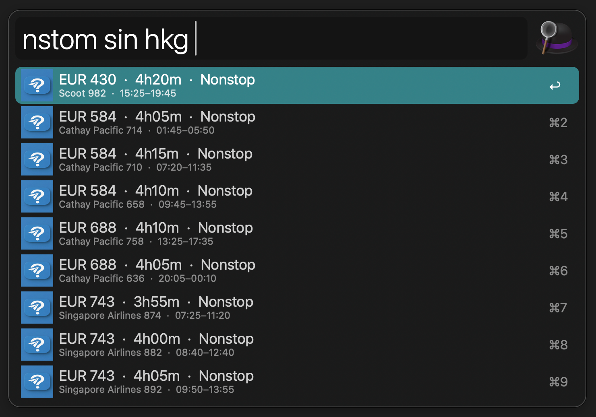
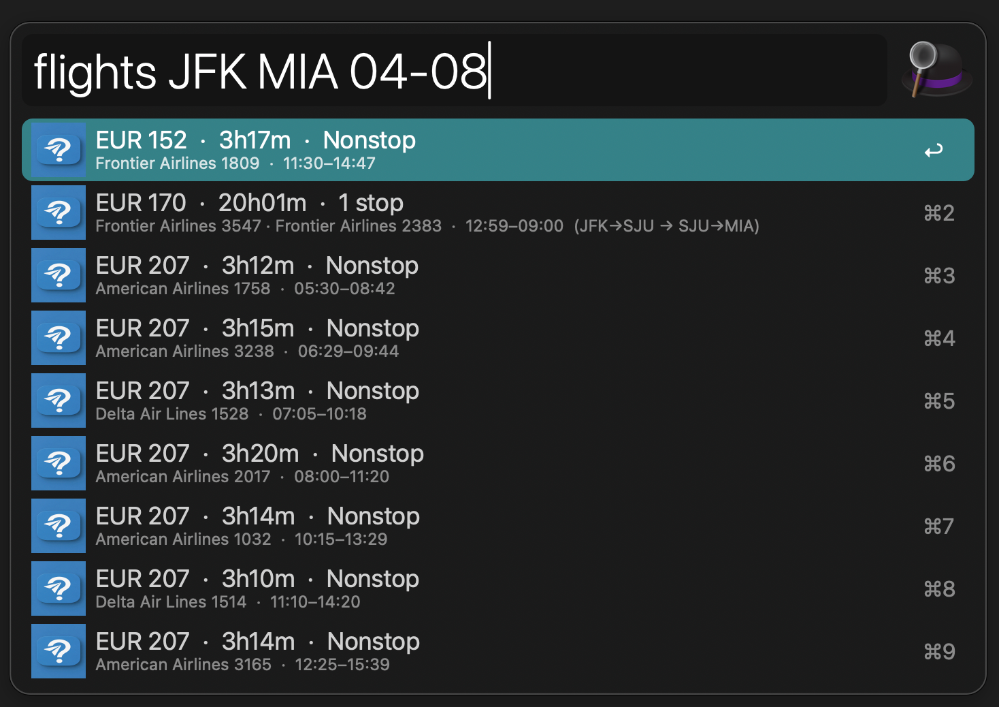

# Fli Flights — Alfred Workflow

Search Google Flights directly from Alfred using the [`fli`](https://github.com/punitarani/fli) CLI. Find flights, compare prices, discover cheapest dates, and add flights to your calendar — all without leaving your keyboard.





## Features

- **Flight search** with full filtering (class, stops, airlines, time window)
- **Cheapest dates** finder across date ranges
- **Nonstop shortcuts** for today and tomorrow
- **Timezone-aware calendar events** via `.ics` with correct local times
- **Google Flights URL** embedded in calendar events
- **Smart date entry** — just type `MM-DD`, year is auto-filled
- **Built-in help** — type `flyhelp` for the full interactive guide

## Installation

### Prerequisites

1. [Alfred](https://www.alfredapp.com/) with Powerpack
2. Install `fli`:
   ```bash
   # Install uv if you don't have it
   brew install uv

   # Install fli
   uv tool install flights
   ```
3. Install `airportsdata` (for calendar timezone support):
   ```bash
   /usr/bin/python3 -m pip install --user airportsdata
   ```

### Install the Workflow

Download [`Fli-Flights.alfredworkflow`](Fli-Flights.alfredworkflow) and double-click to import into Alfred.

## Commands

### `flights` — Search flights on a specific date

```
flights JFK LHR 05-15
flights JFK LHR 05-15 --return 05-22
flights JFK LHR 05-15 --class BUSINESS --stops NON_STOP
flights JFK LHR 05-15 --sort DURATION --time 6-20
flights JFK LHR 05-15 --airlines BA AA
```

| Action | Keyboard | Trackpad / Mouse |
|--------|----------|------------------|
| Copy flight details | `Enter` | Click |
| Open Google Flights | `Cmd+Enter` | `Cmd+Click` |
| Add to Calendar | `Shift+Cmd+Enter` | `Shift+Cmd+Click` |

### `nsflt` — Nonstop flights today

```
nsflt BCN AMS
nsflt JFK LAX --class BUSINESS
```

### `nstom` — Nonstop flights tomorrow

```
nstom BCN AMS
nstom SFO NRT --sort DURATION
```

### `flydates` — Find cheapest travel dates

```
flydates JFK LHR
flydates JFK LHR --from 06-01 --to 07-01
flydates JFK LHR --round --duration 7
flydates JFK LHR --friday --saturday
```

| Action | Keyboard | Trackpad / Mouse |
|--------|----------|------------------|
| Open Google Flights | `Enter` | Click |
| Copy details | `Cmd+Enter` | `Cmd+Click` |

### `flyhelp` — Interactive guide

```
flyhelp
flyhelp business
```

Type `flyhelp` to browse all commands and options. Type to filter.

## Options Reference

### flights / nsflt / nstom

| Option | Values | Default |
|--------|--------|---------|
| `--class` | `ECONOMY` `PREMIUM_ECONOMY` `BUSINESS` `FIRST` | `ECONOMY` |
| `--stops` | `ANY` `NON_STOP` `ONE_STOP` | `ANY` |
| `--sort` | `CHEAPEST` `DURATION` `DEPARTURE_TIME` `ARRIVAL_TIME` | `CHEAPEST` |
| `--return` / `-r` | `MM-DD` | one-way |
| `--time` | `6-20` (24h range) | any |
| `--airlines` | IATA codes | all |

### flydates

| Option | Values |
|--------|--------|
| `--from` / `--to` | `MM-DD` date range |
| `--round` / `-R` | Round-trip mode |
| `--duration` / `-d` | Trip length in days |
| `--monday` … `--sunday` | Day-of-week filters |
| `--class` / `--stops` | Same as flights |

## Calendar Integration

When you press `Shift+Cmd+Enter` on a flight result:

- A `.ics` file is generated with **timezone-aware** start/end times (using `airportsdata` for 7,800+ airport timezone mappings)
- The event title is clean: `✈ KLM 1366 · BUD → AMS`
- The notes include price, airport details, all other flight options from the search, and a credit line
- The event URL links directly to Google Flights
- Calendar.app opens automatically to add the event

## Date Shortcuts

No need to type the year — just use `MM-DD`:
- `05-15` → `2026-05-15` (current year)
- If the date has already passed this year, it rolls to next year
- Full `YYYY-MM-DD` still works

## Currency

The currency you see is determined by Google based on your IP address / geographic location. There is no setting to change it — this is a Google Flights limitation, not a fli or workflow one.

## Files

| File | Purpose |
|------|---------|
| `flights_filter.py` | Script Filter for `flights` |
| `dates_filter.py` | Script Filter for `flydates` |
| `nonstop_filter.py` | Script Filter for `nsflt` / `nstom` |
| `help_filter.py` | Script Filter for `flyhelp` |
| `add_to_calendar.py` | Calendar event generator |
| `info.plist` | Alfred workflow configuration |

## Credits

This workflow is powered by [**fli**](https://github.com/punitarani/fli) — a Google Flights MCP server and Python library by [Punit Arani](https://github.com/punitarani). `fli` provides direct API access to Google Flights data without scraping, making it fast and reliable. Licensed under the [MIT License](https://github.com/punitarani/fli/blob/main/LICENSE.txt).

- Timezone data: [airportsdata](https://pypi.org/project/airportsdata/)

## License

This Alfred workflow is provided as-is. The underlying [fli](https://github.com/punitarani/fli) library is MIT-licensed.
